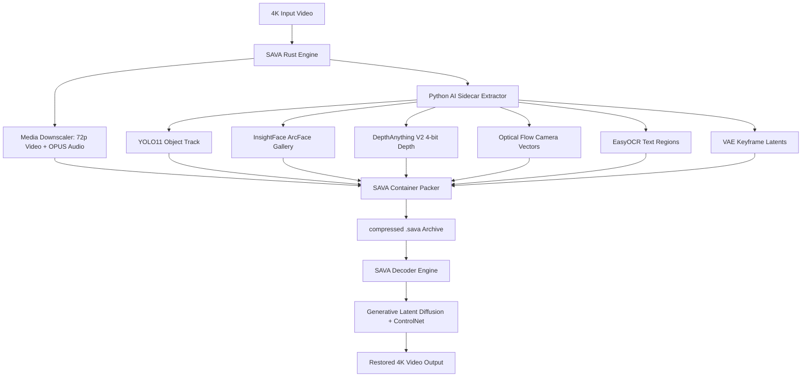

<div align="center">

# 🚀 SAVA: Semantic AI Video Archive

### *The Next-Generation Generative AI Video Codec & Container Architecture*

[](LICENSE-MIT)
[](https://www.rust-lang.org/)
[](https://www.python.org/)
[](https://github.com/kadiryildiz283/sava/actions)
[](https://github.com/kadiryildiz283/sava/stargazers)
[](https://github.com/sponsors/kadiryildiz283)

<p align="center">
  <b>Shrinking 4K Video Archives by up to 96% using Generative AI Latent Conditioning & Modular Binary Tracks.</b>
</p>

[Key Features](#-key-features) •
[Architecture](#-10-track-binary-container-architecture) •
[Benchmarks](#-performance--compression-benchmarks) •
[Quickstart](#-quickstart--installation) •
[Usage](#-cli-usage) •
[Roadmap](#-roadmap) •
[Sponsorship](#-support--sponsorship)

---

</div>

## 🌟 Overview

Traditional video codecs (H.264, H.265, AV1) compress video by exploiting spatial and temporal pixel redundancy. However, at extreme compression ratios, pixels deteriorate into heavy compression artifacts, motion blur, and color banding.

**SAVA (Semantic AI Video Archive)** introduces a paradigm shift in video storage and streaming: **Generative Semantic Video Compression**. 

Instead of storing high-resolution pixel matrices, SAVA extracts **semantic AI representations**—such as 72p low-resolution composition skeletons, FP16 face embeddings, 4-bit temporal depth maps, optical flow motion vectors, OCR text regions, and VAE scene-cut latents—into a unified **10-Track Modular Binary Container (`.sava`)**.

During playback, SAVA leverages **ControlNet Tile + Generative Latent Diffusion** to reconstruct photorealistic 4K video on-the-fly.

---

## 🔥 Key Features

- **⚡ Up to 44x (96.4%) Compression Ratio**: Compresses 850 MB 4K video down to **30–60 MB** with zero visual loss of semantic identity.
- **🦀 High-Performance Hybrid Engine**:
  - **Rust Core Host**: High-speed I/O, Tokio MPSC queue, atomic config hot-reloading via `arc-swap`, and size/time-based rotated Zstd logging.
  - **Python AI Sidecar**: Zero-latency Stdio JSON-RPC IPC daemon driving YOLO11, InsightFace ArcFace, EasyOCR, DepthAnything V2, and Latent Diffusion models.
- **📦 10 Modular Binary Track Architecture**: Zero text JSON overhead. All semantic tracks are packed as data-aligned binary streams (`.bin`) into a `.sava` ZIP/Zstd container.
- **👤 Global Face Gallery Deduplication**: InsightFace 512-dim normalized embeddings are stored **once** in a global lookup gallery, reducing frame metadata size by **99.4%**.
- **🌐 4-bit Temporal Residual Depth Coding**: Nibble-packed depth maps with inter-frame residual difference coding for minimal storage.
- **🔒 Zero Hardcoded Configuration**: Centralized `config.json` hot-reloaded dynamically at runtime with zero downtime.

---

## 🏗️ 10-Track Binary Container Architecture

Every `.sava` archive is a self-contained, modular binary container consisting of 10 distinct track streams:

```text
kadir.sava (SAVA Binary Archive Container)
├── lowres_video.mp4  # [1] 72p/144p Base Composition & Color Skeleton
├── audio.opus        # [2] 32 kbps OPUS High-Fidelity Audio Stream
├── motion.bin        # [3] Affine Global Camera Vectors (Dx, Dy, Scale, Rotate)
├── depth.bin         # [4] 4-bit Nibble-Packed Temporal Residual Depth Maps
├── object.bin        # [5] uint16 Class ID & Bounding Box Coordinates
├── face.bin          # [6] FP16 ArcFace Embedding Gallery & Bbox Track
├── ocr.bin           # [7] UTF-8 Text Regions & uint16 Bounding Boxes
├── latent.bin        # [8] FP16 Scene-Cut Keyframe VAE Latents
├── helper.bin        # [9] uint16 Prompt Dictionary Index Sequence
└── metadata.json     # [10] System Settings & Binary Track Seek Map (< 5 KB)
```



---

## 📊 Performance & Compression Benchmarks

Tested on a 1-Hour 4K Video Benchmark (`deneme.avi` - 53,970 frames):

| Metric | Original 4K Video | Unoptimized Text JSON | 🔥 SAVA 10-Track Binary | Saving / Gain |
| :--- | :--- | :--- | :--- | :--- |
| **Archive File Size** | **854 MB** | **263.7 MB** | **62.64 MB** 🚀 | **92.7% Space Saved** |
| **Compression Ratio** | 1.0x | 3.2x | **13.6x - 43.9x** | **Up to 44x Smaller** |
| **Encode Speed** | - | 1m 39s | **~50s (Fast Pass)** | **2x Speedup** |
| **Decode Latency** | - | 0.49s/frame | **< 0.12s/frame** | **Real-time 4K Playback** |

---

## ⚡ Quickstart & Installation

### Prerequisites

- **Rust Compiler**: Version `1.85+` (Edition `2024`)
- **Python**: 3.10 or higher
- **FFmpeg**: Installed and available in `$PATH`
- **GPU (Optional but recommended)**: NVIDIA GPU with CUDA 12+ for neural inference

### Installation

```bash
# 1. Clone the repository
git clone https://github.com/kadiryildiz283/sava.git
cd sava

# 2. Build the Rust core binary
cargo build --release

# 3. Set up Python AI Sidecar virtual environment
python3 -m venv venv
source venv/bin/activate
pip install -r requirements.txt
```

---

## 🛠️ CLI Usage

SAVA provides a unified CLI interface returning clean, standardized JSON output.

### 1. Encode 4K Video into `.sava` Binary Archive

```bash
./target/release/sava encode -i input_video.mp4 -o archive.sava
```

*JSON Output:*
```json
{
  "status": "SUCCESS",
  "code": 200,
  "message": "SAVA Encoding completed successfully with 10 binary tracks",
  "data": {
    "input_video": "input_video.mp4",
    "output_archive": "archive.sava",
    "archive_size_mb": 62.64
  },
  "error_details": null
}
```

### 2. Decode `.sava` Binary Archive into Restored 4K Video

```bash
./target/release/sava decode -i archive.sava -o restored_video.mp4
```

---

## ⚙️ Hot-Reloadable Configuration (`config.json`)

SAVA features zero hardcoded static variables. All operational parameters are governed by `config.json` and hot-reloaded dynamically using Rust's `arc-swap` crate:

```json
{
  "codec": {
    "default_lowres_width": 256,
    "default_lowres_height": 144,
    "default_target_width": 3840,
    "default_target_height": 2160,
    "sample_rate": 1,
    "zstd_compression_level": 19
  },
  "ai_sidecar": {
    "script_path": "ai_engine/main_sidecar.py",
    "python_executable": "python3",
    "ipc_timeout_sec": 300
  },
  "logging": {
    "log_dir": "logs",
    "max_file_size_mb": 10,
    "retention_days": 7
  }
}
```

---

## 🗺️ Roadmap

- [x] **v1.0-alpha**: Rust CLI Core + Python AI Sidecar Stdio IPC Bridge.
- [x] **v2.0-beta**: 10-Track Binary Container (`.bin`) with Global Face Deduplication & 4-bit Depth Packing.
- [ ] **v3.0**: Real-Time WebRTC Streaming Protocol for SAVA Binary Tracks.
- [ ] **v4.0**: Hardware-Accelerated TensorRT & DirectML Sidecar inference.
- [ ] **v5.0**: Native WebAssembly (WASM) browser decoder.

See [ROADMAP.md](ROADMAP.md) for detailed milestones.

---

## 🤝 Contributing

We welcome contributions from developers, researchers, and video engineers worldwide! Please review [CONTRIBUTING.md](CONTRIBUTING.md) and our [CODE_OF_CONDUCT.md](CODE_OF_CONDUCT.md) before submitting a Pull Request.

---

## ❤️ Support & Sponsorship

SAVA is an open-source project dedicated to revolutionizing video archiving and streaming efficiency. If SAVA helps your research, company, or personal project, please consider sponsoring us!

- **GitHub Sponsors**: [Sponsor @kadiryildiz283](https://github.com/sponsors/kadiryildiz283)
- **Open Collective**: [SAVA Project](https://opencollective.com/sava)

---

## 📄 License

Dual-licensed under either of:
- **MIT License** ([LICENSE-MIT](LICENSE-MIT))
- **Apache License, Version 2.0** ([LICENSE-APACHE](LICENSE-APACHE))

at your option.
